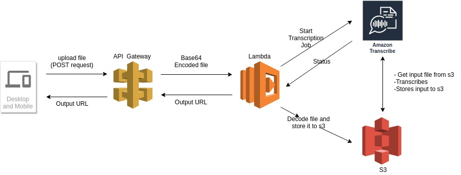

# Project Title

API that does voice transcription.

## Technologies used

#### AWS API Gateway: for building the api
Scalability up and down automatically based on requests
Integrated with AWS Services such Lambda 
Pyload modeling and Transformation

#### AWS Lambda: for the operational tasks
No resource management needed, we can focus only on the tasks needed.
Scalability.
Integration with AWS Services such as API Gateway, S3 and Transcribe.
#### AWS S3: for storing files(input and output) 
Scalability
No management needed
Integration with AWS services such as lambda and Transcribe.
#### AWS Transcribe

### Overview

A post request containing the audio file is send to API Gateway, where it's encoded to base64(to be able to upload the file without corrupting it), API Gateway passes the payload through to Lambda where the body(containing the base64 encoded file) is decoded and then stored in an s3 bucket. After that, Lambda configures and starts the AWS transcribe job and returns the Transcribe output url(made public on s3) as response to API Gateway, which sends it as a response the the request. 


the API works in an asynchronous way:
Send request with the input file, and receive response containing the result url.
The reason for the asynchronous choice is that AWS Transcribe can take time, sending the result url while the processing is taking place in the background allows the request sender to focus resources on something else(other than waiting)

The uploaded file and the result file are both available on s3.

### Architecture



## Running the tests

from a terminal 
```
curl -X POST -F "data=@test_file.mp3" https://cybu70ogsc.execute-api.us-east-2.amazonaws.com/Dep1 -H "Content-Type: application/json"
```
Expected output:
{
 "statusCode": 200, 
 "transcript_url": "result_url", 
 "Message": "Information about the status"
}

I have chosen to return a url with the entire Transcription Job output.

or a simply a post request with the audio file from an API development environment(such as POSTMAN) to the address https://cybu70ogsc.execute-api.us-east-2.amazonaws.com/Dep1

Needless to say, this can also be integrated in other applications.

## Code
The main code is for the Lambda function.
Because Python library base64 which is external (not available in AWS SDK) was used, the code has been packaged as a Python Deployment package and uploaded to Lambda.
(In a nutshell, the python deployment package contains the lambda code in addition to the site packages of a virtual environment where are the needed libraries are installed) 
Some configurations were done for API Gateway(Payload Transformation) and S3 buckets permissions, but no major code.

## Improvements:
Many improvements can be added here:
-Improvements or changes should be made with the intended production use in mind.
-Lambda is very convenient for fault tolerence, but proper Error handling can be added to deliver meaningful information.
-The result can be tailored as needed as opposed to deliver it as it is.
-More strict security policies can be applied to the output file access on s3(depending on the use case)

